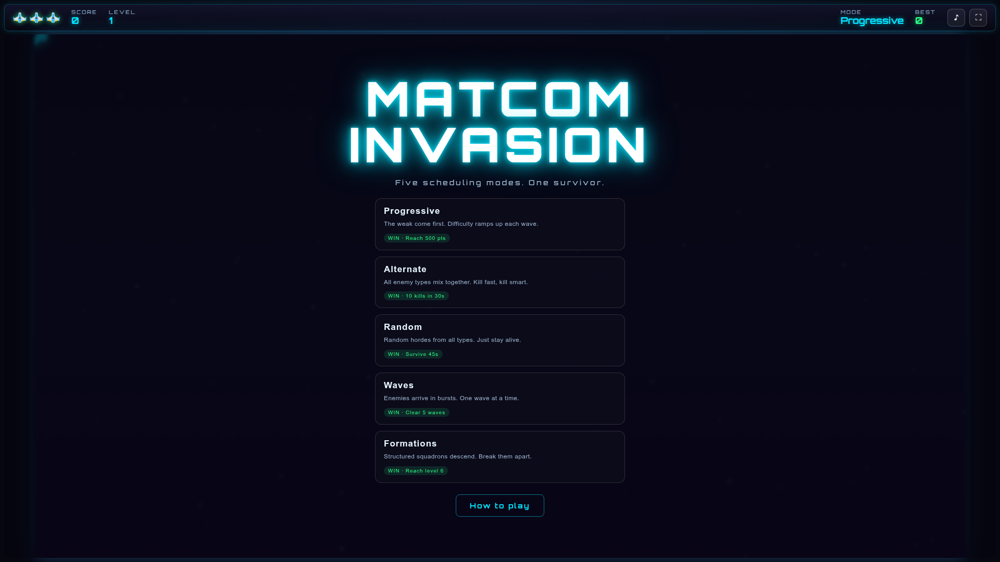
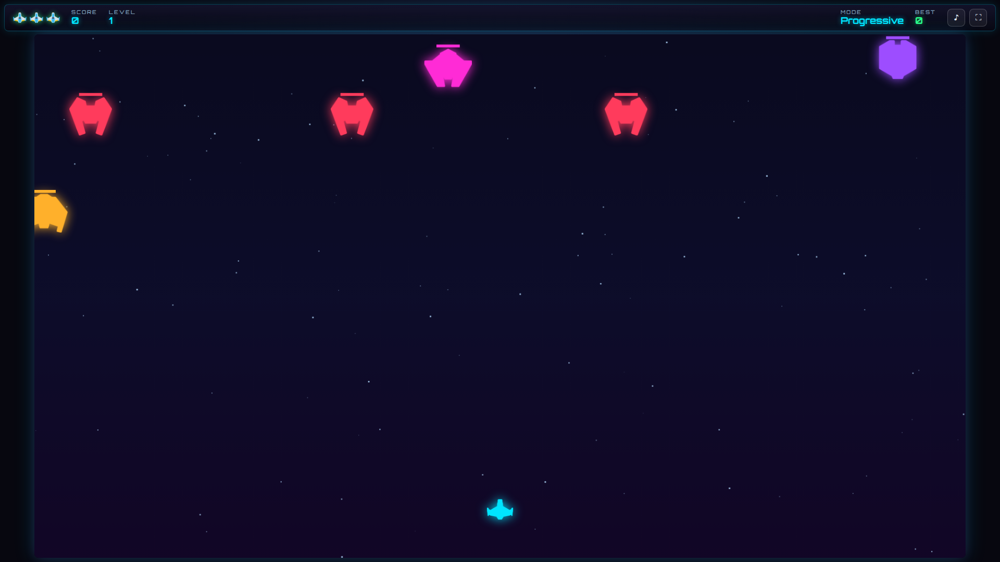
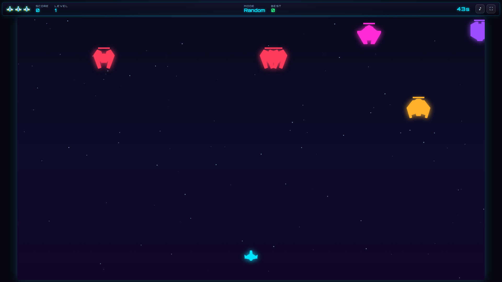

# MatCom Invasion — Web Port

A modern, neon-styled re-imagining of a classic retro arcade game, rebuilt as a
hybrid **C → WebAssembly + TypeScript/Vite** app. The entire game engine runs in
compiled C (ported to WASM), while the UI is a TypeScript SPA.

[](https://github.com/LiaLopezRosales/MatCom_Invasion/actions/workflows/deploy.yml)

This is a portfolio project demonstrating a clean migration from a monolithic C
codebase into a maintainable, tested, multi-platform game.

---

## Table of Contents

- [Play it](#play-it)
- [Screenshots](#screenshots)
- [Features](#features)
- [Game modes](#game-modes)
- [Architecture](#architecture)
- [Quick start](#quick-start)
  - [Native CLI](#native-cli)
  - [Web (browser)](#web-browser)
- [Controls](#controls)
- [Repository structure](#repository-structure)
- [Testing & quality](#testing--quality)
- [Dependencies](#dependencies)
- [Limitations & roadmap](#limitations--roadmap)
- [License & credits](#license--credits)

---

## Play it

> 🕹️ **Play the live demo:** <https://lia.lopezrosales.github.io/MatCom_Invasion/>
>
> Deployed automatically to GitHub Pages by the [CI pipeline](.github/workflows/deploy.yml)
> on every push to `main`.


---

## Screenshots

Captured automatically from the live demo build.

| Menu | Gameplay — Progressive | Gameplay — Random (survival) |
|------|------------------------|------------------------------|
|  |  |  |

---

## Features

- **Deterministic C game engine** compiled to WebAssembly — exactly the same
  logic runs natively and in the browser.
- **5 game modes** (see below), each with its own win condition and spawn
  scheduler.
- **5 enemy types**, procedural difficulty scaling, 3 lives.
- **Neon space aesthetic**: glow effects, drifting starfield, per-type enemy
  tinting over CC0 Kenney sprites.
- **Fully synthesized audio** (Web Audio API) — ambient music per state plus
  SFX, no audio files, with a mute toggle.
- **Modern UI**: HTML/CSS HUD, mode-select / how-to-play / pause / game-over /
  victory overlays, fullscreen toggle.
- **Snapshot-based bridge**: the C engine exports a fixed-layout state snapshot
  (guarded by a compile-time layout assertion) that TypeScript reads each frame.

---

## Game modes

| Mode | Spawn strategy | Win condition |
|------|----------------|---------------|
| **Progressive** | The weak come first; difficulty ramps each wave | Reach 500 points |
| **Alternate** | All enemy types mix together | 10 kills in 30s |
| **Random** | Random hordes from all types | Survive 45s |
| **Waves** | Enemies arrive in bursts | Clear 5 waves |
| **Formations** | Structured squadrons descend in blocks | Reach level 6 |

---

## Architecture

```
┌─────────────────────────────┐       ┌──────────────────────────────┐
│         C engine (src/)     │       │       TypeScript UI (web/)   │
│                             │       │                              │
│  game.c  scheduler.c        │  WASM │  main.ts  (game loop, menus) │
│  enemy.c projectile.c  …    │ ─────▶│  render.ts (canvas, neon)    │
│                             │       │  audio.ts  (Web Audio synth) │
│  exports a fixed snapshot   │       │  game.ts   (reads snapshot)  │
└─────────────┬───────────────┘       └──────────────┬───────────────┘
              │   compiled by Emscripten              │   built by Vite
              └───────────────────────────────────────┘
```

- **Engine** (`src/`): platform-agnostic C with a fixed-size `game_state_snapshot_t`
  exported via a configurable game loop. Deterministic (seeded RNG) and
  single-threaded.
- **WASM layer**: Emscripten glue compiles the same C to a browser module; the
  exported snapshot layout is protected by `_Static_assert` in `src/types.h`.
- **Frontend** (`web/`): Vite + TypeScript. A game loop calls
  `game.update(dt)` each frame, reads the snapshot, and renders to a 1920×1080
  canvas with an HTML/CSS HUD and overlays.

---

## Quick start

Prerequisites:

- A C11 compiler (`gcc`/`clang`) and `make`
- [Emscripten SDK](https://emscripten.org/) (tested with **emsdk 6.0.9**) on
  `PATH` for the WASM build
- Node.js ≥ 18 and npm (for the web frontend)

### Native CLI

```sh
make native        # build the CLI game (invasion)
make test          # run the C unit + simulation test suite
./invasion         # run the game (scheduler)
```

### Web (browser)

```sh
# 1. Build the C engine to WASM (Emscripten must be active)
make wasm          # outputs web/public/matcom_logic.js + .wasm

# 2. Install and run the frontend
cd web
npm install
npm run dev        # http://localhost:5173
```

Production build:

```sh
cd web && npm run build   # outputs web/dist/
npm run preview           # serve the production build locally
```

> Headless browser smoke test (`web/smoke.test.mjs`): with a dev server running,
> a Playwright script boots the app, starts every mode, asserts the spawn batch,
> the visible countdown timer (Random/Alternate), persistent high scores, and
> jargon-free mode descriptions, with zero console/page errors.

---

## Controls

| Action | Input |
|--------|-------|
| Move the ship | Mouse position |
| Fire | Hold left mouse button |
| Pause / resume | `Esc` |
| Mute audio | Speaker button (top-right) |
| Toggle fullscreen | Fullscreen button (top-right) |

---

## Repository structure

```
.
├── src/               # C game engine (game, scheduler, enemy, projectile, balance…)
├── tests/             # Criterion C tests + headless simulation runner
├── web/
│   ├── public/
│   │   ├── assets/    # CC0 Kenney sprites (see LICENSE.txt)
│   │   └── matcom_logic.{js,wasm}   # Emscripten build output (gitignored)
│   └── src/
│       ├── main.ts    # app entry, game loop, menus
│       ├── game.ts    # WASM binding + snapshot reader
│       ├── render.ts  # canvas rendering + neon tinting
│       ├── audio.ts   # Web Audio synthesized music + SFX
│       └── styles.css # neon theme
├── docs/planning/     # design docs (per-phase specs and decisions)
├── Makefile           # native / wasm / test targets
└── README.md
```

---

## Testing & quality

- **C engine**: 78 unit + simulation tests via [Criterion](https://criterion.readthedocs.io/),
  run with AddressSanitizer and UndefinedBehaviorSanitizer. Coverage 97.15%.
- **Compilation**: strict warnings as errors (`-Werror`), `-Wall -Wextra`.
- **Frontend**: TypeScript strict + `vite build` and an automated headless browser
  smoke test.

```sh
make test
make coverage   # optional, requires gcov/lcov
```

---

## Dependencies

- **C engine**: C11, POSIX, Criterion (dev), Emscripten (WASM build).
- **Web**: Vite, TypeScript. Runtime deps are nil — sprites are static files and
  audio is synthesized.
- **Art**: [Kenney *Space Shooter Redux*](https://kenney.nl/assets/space-shooter-redux)
  (CC0), bundled under `web/public/assets/`.
- **Font**: [Orbitron](https://fonts.google.com/specimen/Orbitron) (OFL) via Google
  Fonts CDN.

---

## Limitations & roadmap

- **Touch support** is not implemented (mouse/keyboard focused).
- **Power-ups** were deliberately de-scoped in Phase 4 (kept the engine focused);
  listed as future work.
- **CI/CD is live**: GitHub Actions runs native + WASM tests and builds, and
  deploys `web/dist` to GitHub Pages on every push to `main` (see
  `docs/planning/FASE6_CI.md` and the CI badge above).
- Real in-browser **screenshots** are shown above (captured from the live demo).

---

## License & credits

- **Code**: MIT License — see [`LICENSE`](LICENSE).
- **Art**: [Kenney *Space Shooter Redux*](https://kenney.nl/assets/space-shooter-redux)
  (CC0) — attribution appreciated but not required. License text bundled at
  [`web/public/assets/LICENSE.txt`](web/public/assets/LICENSE.txt).
- **Font**: Orbitron (SIL Open Font License) by Matt McInerney.
